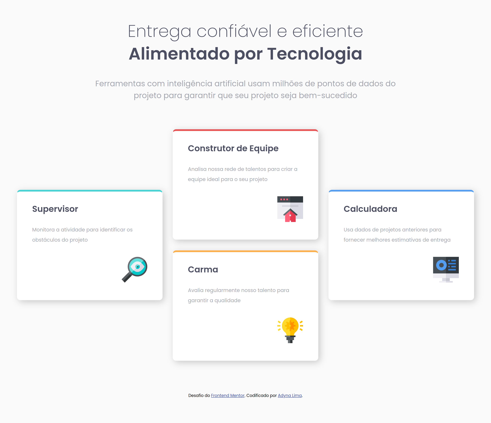
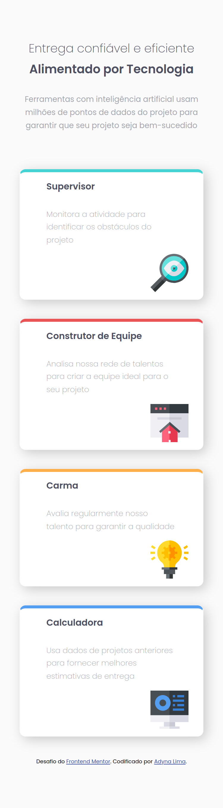

# Solução de seção de recursos de quatro cartões

Esta é uma solução para o [desafio da seção de recursos de quatro cartas no Frontend Mentor](https://www.frontendmentor.io/challenges/four-card-feature-section-weK1eFYK). 

## Índice

- [Visão geral](#visão-geral)
  - [O desafio](#o-desafio)
  - [Captura de tela](#captura-de-tela)
  - [Links](#links)
- [Meu processo](#meu-processo)
  - [Construído com](#construído-com)
  - [O que aprendi](#o-que-aprendi)
  - [Desenvolvimento contínuo](#desenvolvimento-contínuo)
  - [Recursos úteis](#recursos-úteis)
- [Autor](#autor)
- [Agradecimentos](#agradecimentos)

## Visão geral

### O desafio

Os usuários devem ser capazes de:

- Ver o layout ideal para o site, dependendo do tamanho da tela do dispositivo (375px/1440px)

### Captura de tela

 
 

### Links

- URL da solução: [GitHub](https://github.com/adynaslima/secao-de-recurso-de-quatro-cartas.git)
- URL do site: [Site](https://secao-de-recurso-de-quatro-cartas.vercel.app/)

## Meu processo

### Construído com

- Marcação HTML5 semântica
- Propriedades personalizadas CSS
- Flexbox
- Fluxo de trabalho móvel primeiro

### O que aprendi

```css
.cabecalho {
  display: flex;
  flex-direction: column;
  justify-content: center;
  line-height: 0;
}

.principal {
  display: flex;
  align-items: center;
  column-gap: 30px;
  justify-content: center;
}
```

### Desenvolvimento contínuo

Preciso me desenvolver mais no Flexbox e no Grid, pois ainda tenho dificuldade no uso seguro desses recursos; e passar a estudar com afinco JavaSpript, para colocar interação nos meus projetos. 

### Recursos úteis

- [Flexbox](https://www.alura.com.br/artigos/css-guia-do-flexbox?gclid=Cj0KCQiAjbagBhD3ARIsANRrqEsWkFqggePzbS3AqlWhuoHChdcobyoqSTBOWBYx_MyZ23Qc0BvIQ4waAncfEALw_wcB) - Este é um artigo incrível que me ajudou a finalmente entender e aplicar o recurso de flexbox, pois nesse projeto eu precisava usá-lo. Agora que consegui entender melhor e vou utilizá-lo daqui para frente.

## Autor

- GitHub - [Adyna Lima](https://github.com/adynaslima)
- LinkedIn - [@adynalima](https://www.linkedin.com/in/adynalima/)

## Agradecimentos

Quero agradecer ao Jorge William Fischdick e a Edilane Silva que me ajudaram nesse projeto, seja tirando dúvidas, seja implementando o código. Meu muito obrigada a vocês!  
